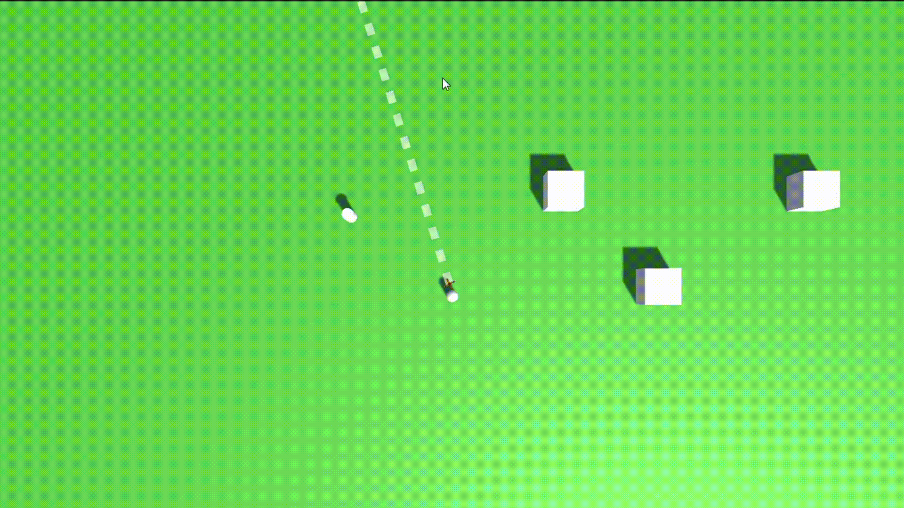
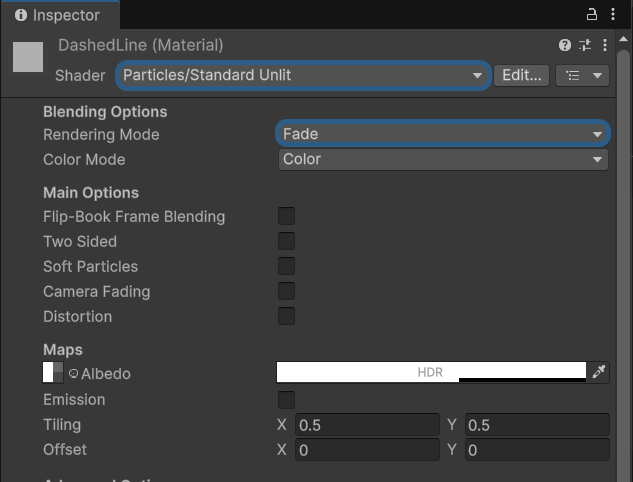
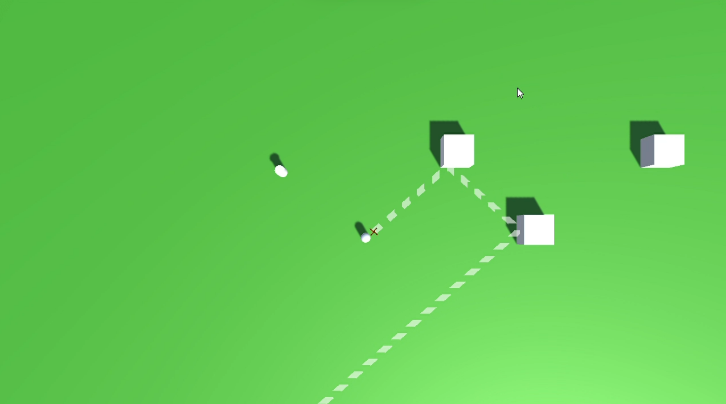
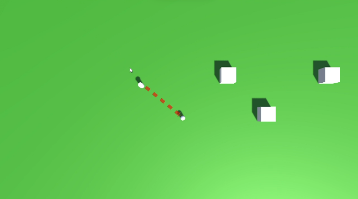

# Game Name + Logo
[Name is in progress] [Logo is in progress]

## Overview
This game is a **skill-based, top-down action puzzler** where the player is fixed at the center of the screen and rotates to face the mouse cursor. The objective is to eliminate all enemies on a grid using a limited number of shuriken throws. Shurikens bounce off walls and obstacles, allowing for creative angles and chain reactions. Success depends on precision, planning, and making the most out of every throw to clear each level as efficiently as possible.

(Insert Gameplay Video or GIF here)

[GameName] was made for a college assignment in collaboration with the [**Diagra 2026 Conference**](https://www.digraconference2026.com/).

### Play Here:
[**Itch.io**](https://dgeoe.itch.io/) (Works on Desktop & Mobile!)

## Script Breakdown
Scripting was kept both simple and short during the project, since the main focus was on creating multiple puzzle levels, it was important to have code that was readable for all team members and easily alterable. 

• **RotationPivot.cs** <br/>
Rotates the player to face the mouse or touch position by raycasting onto the ground layer and aligning the player’s forward direction toward the hit point. <br/> <br/>

• **Throw.cs** <br/>
Handles player input for throwing shurikens. When the player presses, the throw point is shown (activating AimLine.cs); on release, a projectile is fired in the forward direction using a raycast to determine its path. This method of touch and hold to aim and release to fire was used so mechanics match up both on desktop and mobile (where you can't detect where a finger is hovering like you can the mouse cursor).<br/><br/>
- It was important to avoid using any rigid-body physics since a requirement for the college assignment was to have the game run on WebGL; currently, Unity 6 is inconsistent in how physics are calculated between Editor & Web, and since accuracy is the point of the game, hard-coding in ray-casted target paths for projectiles to follow was the way to go!  <br/> <br/>

• **ProjectileLogic.cs** <br/>
This script manages the behavior of each thrown shuriken. Once initialized with a direction, the shuriken continuously moves forward at a fixed speed using FixedUpdate. It handles different collision outcomes based on object tags: enemies take damage while allowing the shuriken to pass through, bounce surfaces reflect the shurikens’ direction using the collision normal, and other objects like walls cause the shurikens to be destroyed. 

### Creating a Dashed Line Renderer for Aiming in Unity
 <br/>
<br/>
This was the one area where I actually ran into some trouble implementing a mechanic, mainly because I first looked online, and everyone is **WAY** overcomplicating the process. First off, to achieve that dashed look seen above, you're going to want to **add an image like [this](https://github.com/Dgeoe/BrigidsCross_Game/blob/Joe's_Branch/BrigidIsCross/Assets/Materials/DashedLine.png)** onto a Material's **Albedo Map**. Then, and this is important, apply these exact settings to said material in the Inspector. <br/><br/>
 
<br/> <br/>
This allows the line to be displayed as you intended while still allowing you to alter its alpha values and color in the Line Renderer's inspector. **Make sure the shader is Unlit**, as otherwise Unity will wash out its colours. <br/> 

To get the line render to follow a given path, you'll want to sub in your Vector 3 target position into:
```csharp
lineRenderer.SetPosition(Index Position, Vector3)
```
For a further breakdown of the actual script, you can read below. <br/><br/>

• **AimLine.cs** <br/>
Visualizes the projected path of a thrown shuriken, including multiple ricochets. Starting from the throw point, it repeatedly casts rays in the current direction, updating each segment of the line to match where the projectile would travel and bounce. <br/>
 <br/> <br/>
When hitting surfaces tagged as “**Bounce**,” the direction is reflected to simulate ricochet behavior, continuing up to a set number of bounces. To achieve this, I first had to set a total number of positions in the line renderers index. Each time you hit bounce, you iterate through all the unused segments in the index and fill them with the final point to keep the line consistent.<br/>
### Bounce Logic
```csharp
private void Update()
{
    //Start position and direction based on throw point
    Vector3 currentPosition = ThrowPoint.position;
    Vector3 currentDirection = ThrowPoint.forward;

    //Set first point of the line (ThrowPoint)
    lineRenderer.SetPosition(0, currentPosition);

    //Loop through each potential bounce
    for (int i = 1; i < maxBounces; i++)
    {
        RaycastHit hit;

        if (Physics.Raycast(currentPosition, currentDirection, out hit, Mathf.Infinity))
        {
            lineRenderer.SetPosition(i, hit.point);

            //Stop Here if no bounce hit
            if (!hit.transform.CompareTag("Bounce"))
            {
                //Fill remaining line positions with final hit point
                FillRemaining(i, hit.point);
                break;
            }

            //Reflect direction based on the surface's normal
            currentDirection = Vector3.Reflect(currentDirection, hit.normal);

            //Offset slightly to prevent sticking to the surface for better visualization
            currentPosition = hit.point + hit.normal * 0.05f;
        }
        else
        {
            //If nothing hits, extend the line forward
            Vector3 endPoint = currentPosition + currentDirection * 10f;
            lineRenderer.SetPosition(i, endPoint);

            //Fill remaining positions with endpoint
            FillRemaining(i, endPoint);
            break;
        }
    }
}

private void FillRemaining(int startIndex, Vector3 point)
{
    //Set additional index positions to = last bounce hit
    for (int i = startIndex + 1; i < maxBounces; i++)
    {
        lineRenderer.SetPosition(i, point);
    }
}
```
---------------------------
The line also changes colour depending on what it intersects, such as enemies, barrels, etc, providing immediate visual feedback to the player. <br/> <br/>

<br/> <br/>
## Credits:
[**Joe O'Shea**](https://dgeoe.itch.io/) - Programmer <br/>
[**Cian Fitzpatrick**](https://rockyhorrorfreakshow.itch.io/) - Fill in task <br/>
[**Daniel Moure**](https://dmotz.itch.io/) - Fill in task <br/>
[**David Fatoye**](https://iddav11.itch.io/) - Fill in task <br/>
